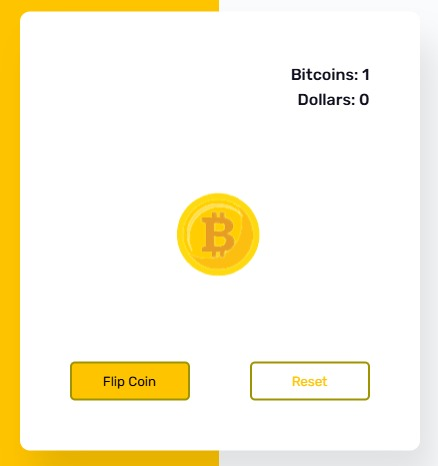

🧮 NYG Bitcoin Dollar Game

The heads or tails game has a very simple code.

📸 Preview

</img>

✨ Features

- 🪙 Coin flip simulation — simulate random coin coughs
- 🎲 Random result — generates heads or tails dynamically
- ₿ Bitcoin counter — tracks number of Bitcoins earned
- 💵 Dollar counter — tracks alternative outcomes
- 🔄 Reset option — restart counters with one click
- ⚡ Instant feedback — updates results in real time
- 🎨 Clean UI — simple and intuitive interface
- 📱 Responsive design — works across different devices

🛠️ Built With

![HTML5]
![CSS3]
![JavaScript]

📁 Project Structure

NYG-Calculator/  
├── index.html     → Page structure  
├── style.css         → Visual styling  
├── script.js           → Flip Logic  
└── [README.md](http://readme.md/)  → Project documentation

👤 Author

**Yuri** — [@NyG007](https://github.com/NyG007)